# API Testing Mermaid Diagrams

This file contains Mermaid versions of the API test diagrams, for better visualization in VS Code with the Mermaid extension.

## Test Snippet #1: GET /posts with filtering

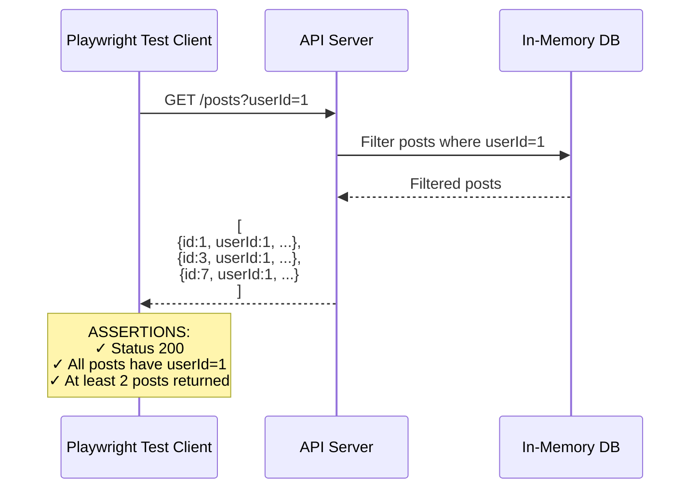

## Test Snippet #2: POST /posts with validation failure

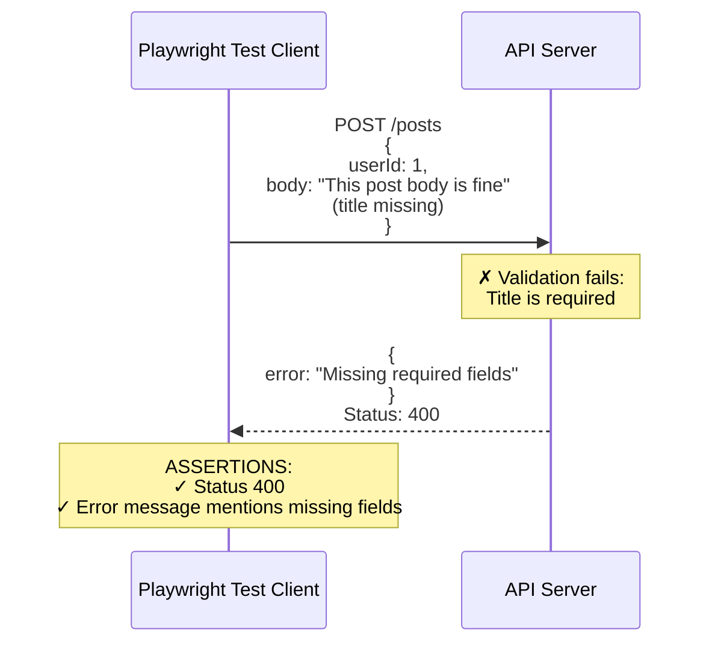

## Test Snippet #3: Bearer Token Authentication

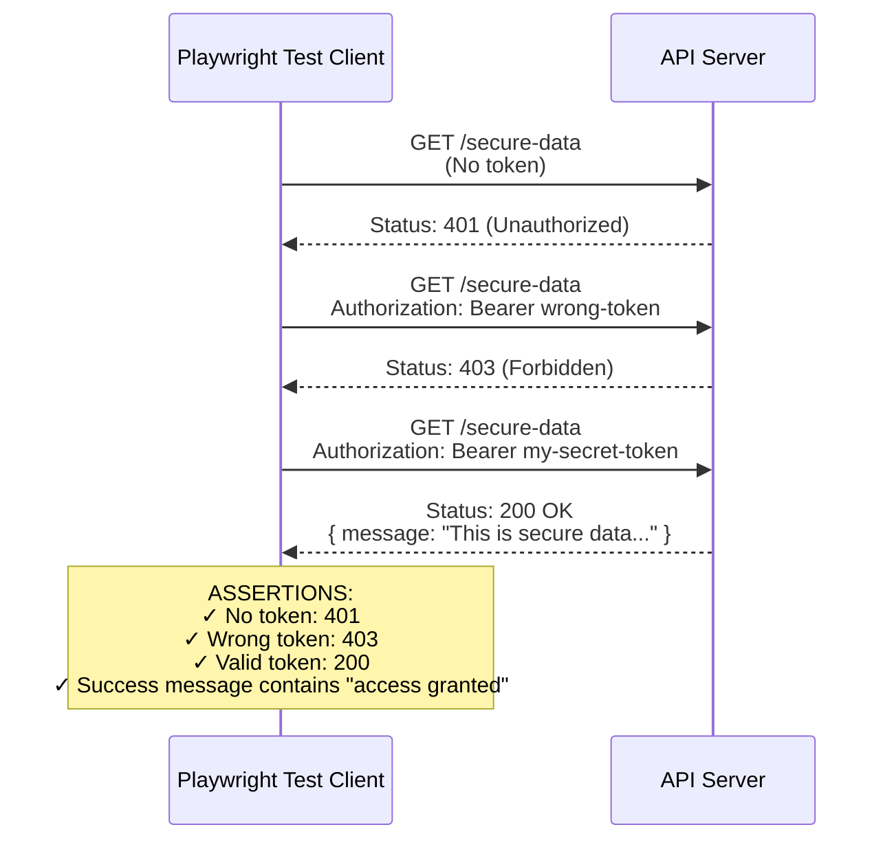

## Test Snippet #4: Authentication Methods

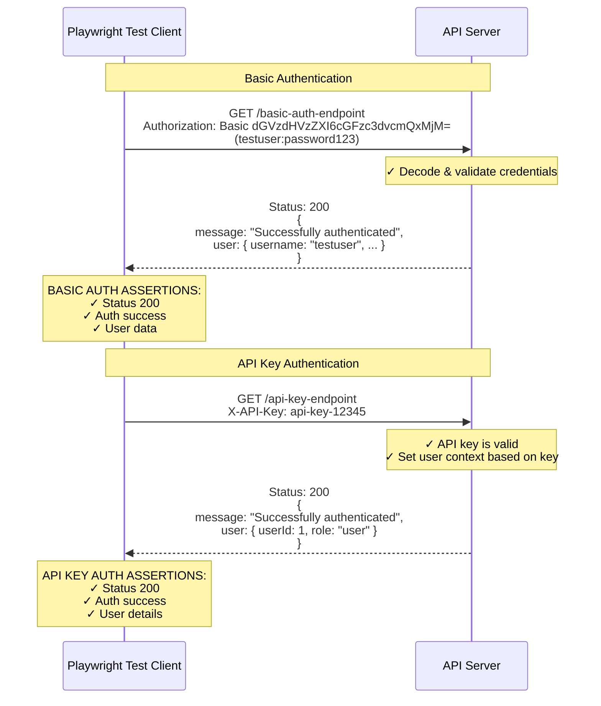

## Test Snippet #5: Token Expiry and Refresh

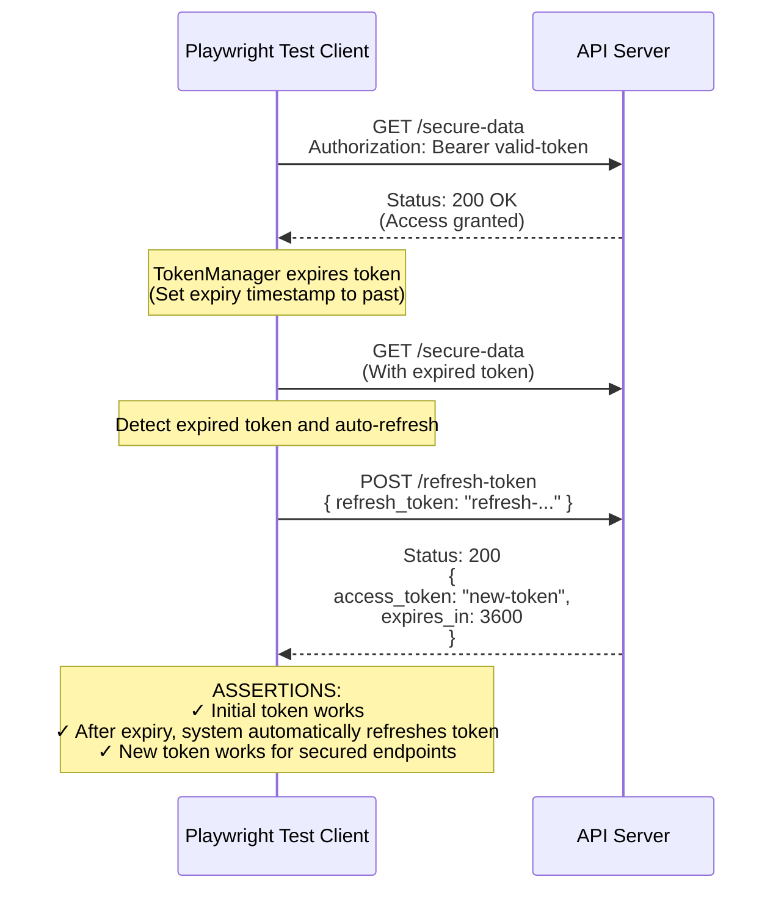

## Test Snippet #6: Role-Based Access Control (RBAC)

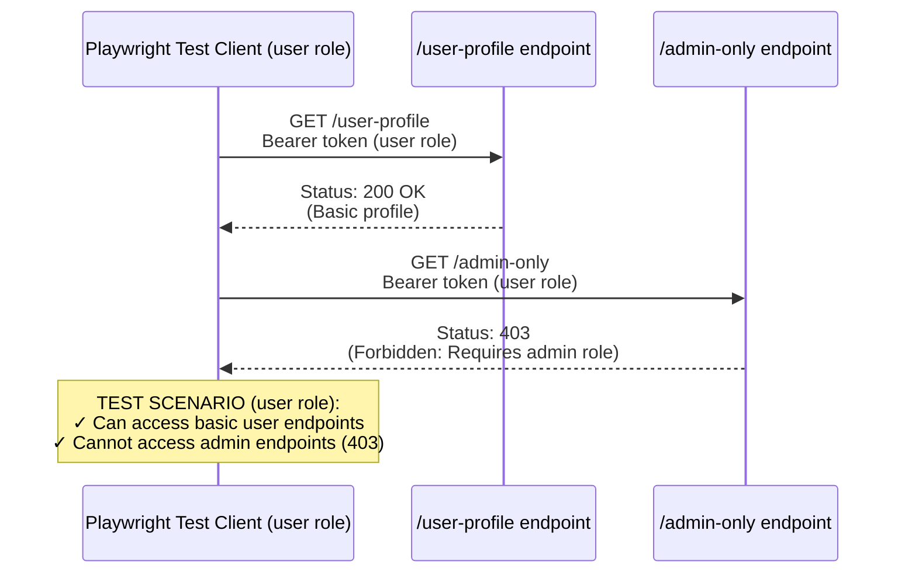

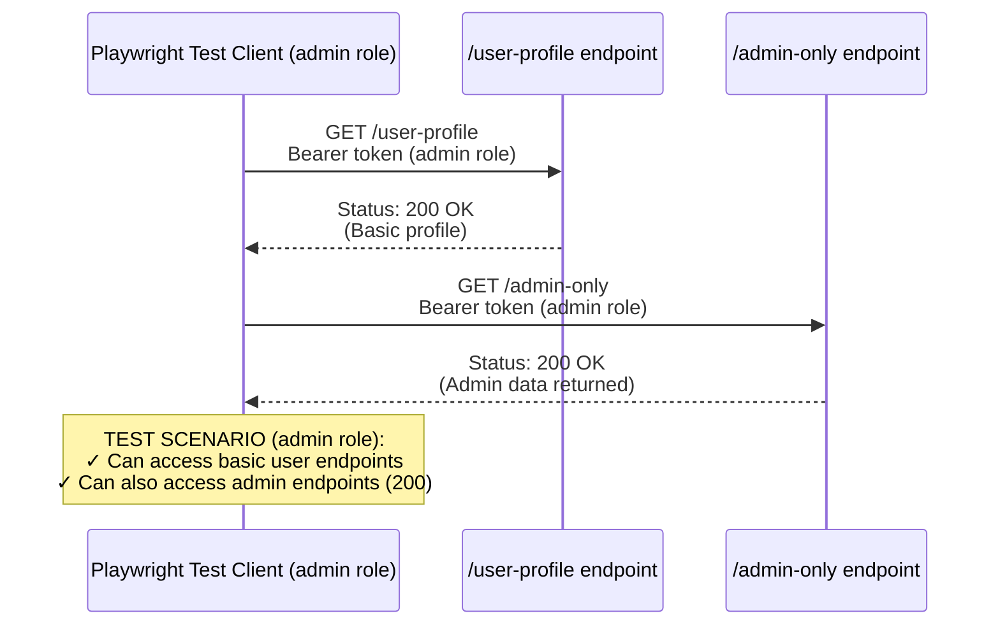

## Test Snippet #7: Security Best Practices

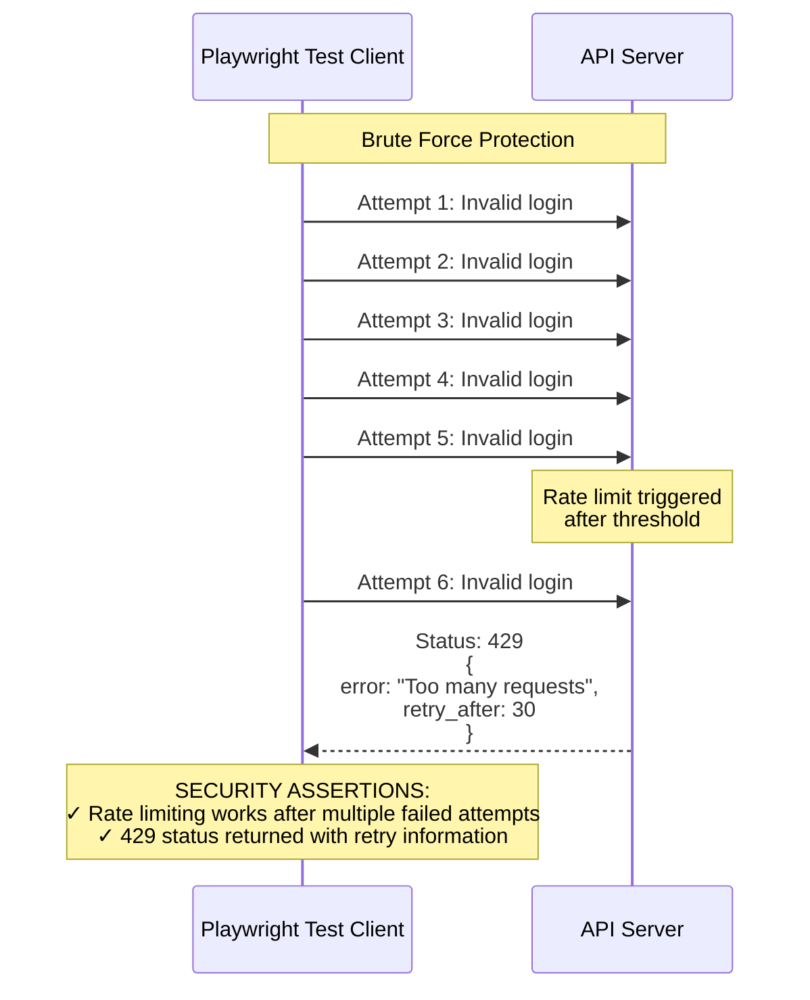

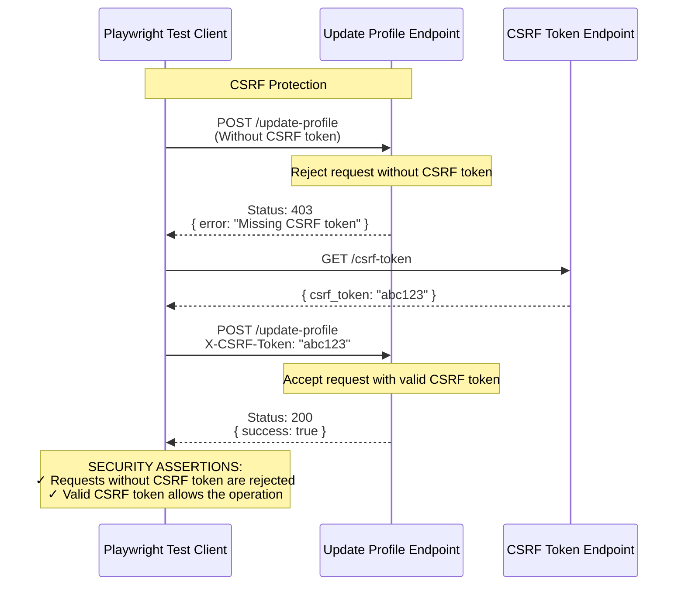

## Test Snippet #8: Real-World API Scenarios

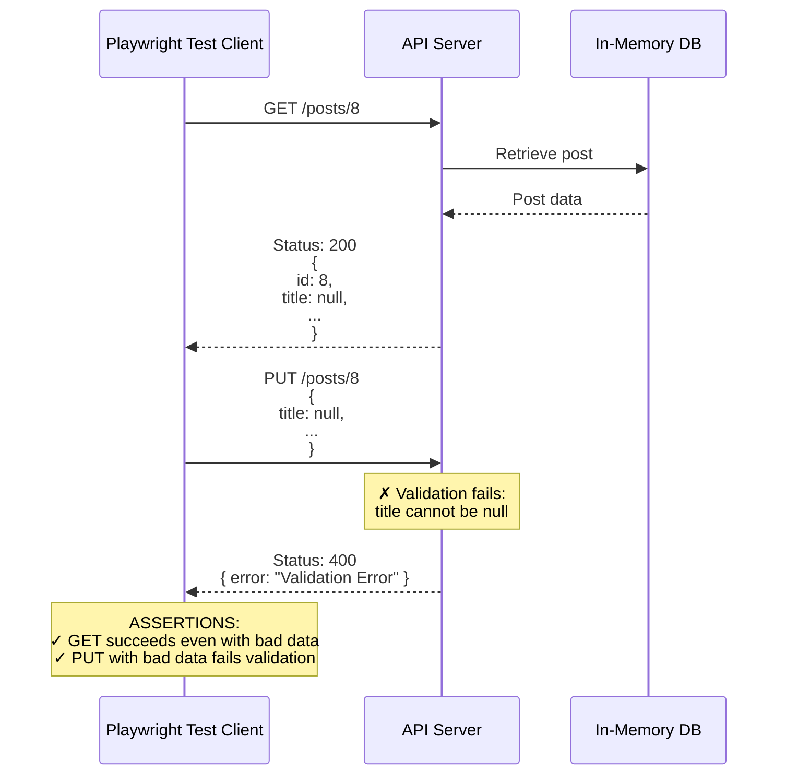

## Test Snippet #9: Token Lifecycle Management

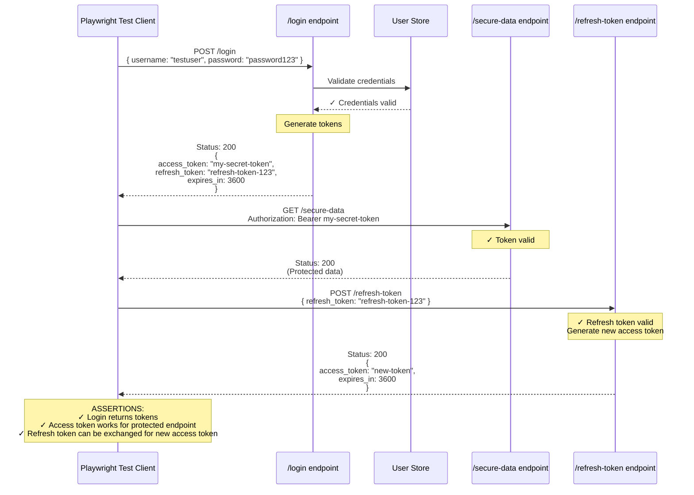

## Test Snippet #10: Authentication Fixtures Pattern

```mermaid
sequenceDiagram
    participant Tests as Test Files
    participant Fixtures as Playwright Fixtures
    participant Server as API Server

    Note over Tests,Fixtures: Define Authentication Fixtures
    Note over Fixtures: authToken = 'my-secret-token'
    
    Note over Fixtures: authAPI = {<br/>  get(url) {<br/>    return request.get(url, {<br/>      headers: {<br/>        Authorization: 'Bearer token'<br/>      }<br/>    })<br/>  }<br/>}

    Tests->>Server: test('User profile', async ({ authAPI }) => {<br/>  const response = await authAPI.get('/user-profile');<br/>});
    Server-->>Tests: Status: 200<br/>(User profile data)

    Note over Tests: ADVANTAGES OF FIXTURES:<br/>✓ Centralized auth logic<br/>✓ Cleaner test code<br/>✓ Easier maintenance when auth requirements change<br/>✓ Role-specific fixtures (user vs admin)
``` 