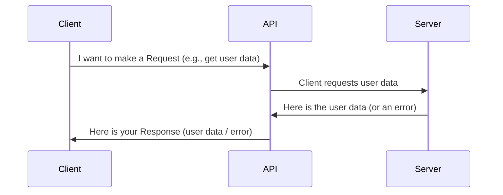
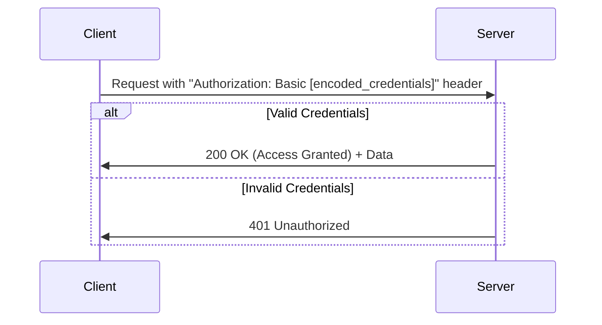
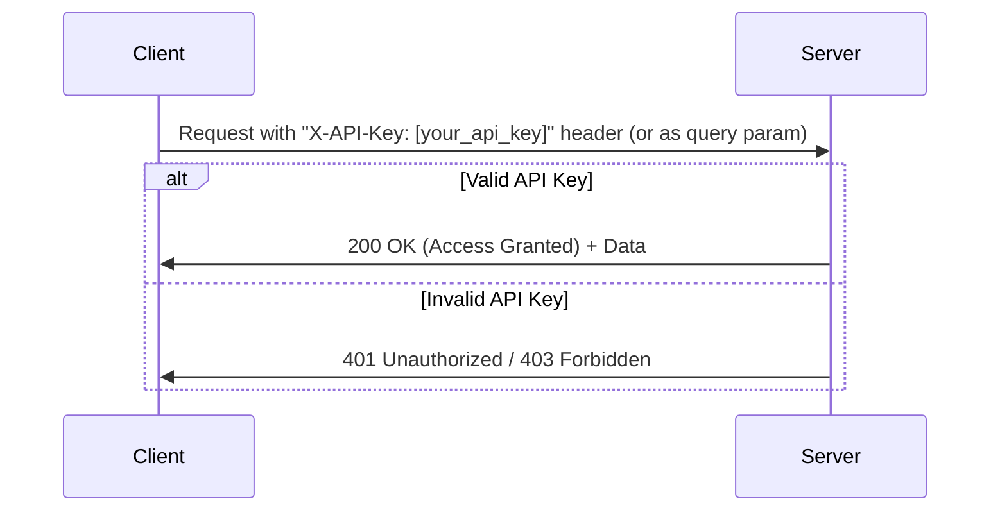
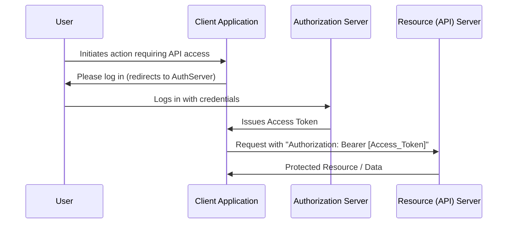
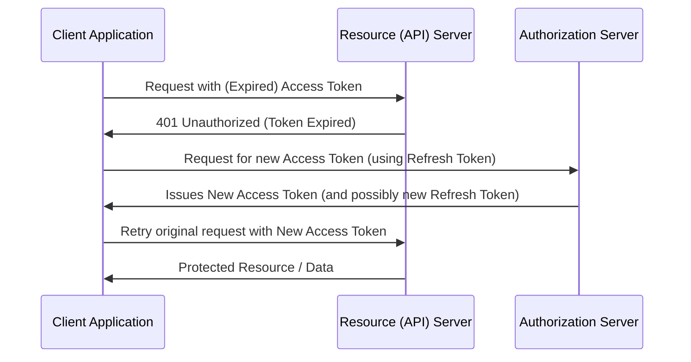

# API Authentication & Token Management: A Practical Guide for Candidates

Welcome! This guide will walk you through essential concepts of API authentication and token management, which are crucial for interacting with and testing modern APIs. We'll connect these ideas to the Playwright test examples you've seen in `4_authMethods.spec.js` and `5_tokenExpiry.spec.js`.

---

## Module 1: Understanding API Requests (The Foundation)

Before we discuss *securing* API interactions, let's ensure we understand the basics of how they work.

**Core Idea:** An API (Application Programming Interface) is like a messenger that takes requests from a **client** (e.g., your test script, a web browser), delivers them to a **server** (where the data or service lives), and then returns the server's **response** back to the client.

**Analogy: Ordering at a counter.**
*   **You (Client):** You want to order food.
*   **Cashier (API):** Takes your order.
*   **Kitchen (Server):** Prepares your order.
*   The Cashier (API) brings your food (Response) back to you.



**Key Components of an API Interaction:**

1.  **Request:** What the client asks for.
    *   **Endpoint (URL):** The specific "address" for the resource or action (e.g., `http://localhost:3000/user_data, `).
    *   **Method (Verb):** The action to perform:
        *   `GET`: Retrieve data (e.g., get a list of users).
        *   `POST`: Send data to create something new (e.g., add a new user).
        *   `PUT`: Send data to update an existing item.
        *   `DELETE`: Remove an item.
    *   **Headers:** Extra information about the request (e.g., content type, or later, authentication details).
    *   **Body (Payload):** The actual data sent with `POST` or `PUT` requests (often in JSON format).

2.  **Response:** What the server sends back.
    *   **Status Code:** A 3-digit number indicating the outcome:
        *   `200 OK`: Success!
        *   `201 Created`: Resource successfully created.
        *   `400 Bad Request`: The server didn't understand the request.
        *   `401 Unauthorized`: You're not allowed yet – you need to authenticate.
        *   `403 Forbidden`: You're authenticated, but not permitted to access this specific resource.
        *   `404 Not Found`: The resource doesn't exist.
        *   `500 Internal Server Error`: Something went wrong on the server.
    *   **Headers:** Extra information about the response.
    *   **Body:** The data (if any) returned by the server (often in JSON format).

**What is JSON?**
JavaScript Object Notation. A lightweight, human-readable format for structuring data.
Example:
```json
{
  "id": 1,
  "name": "Jane Doe",
  "email": "jane.doe@example.com"
}
```

**In Playwright (your `*.spec.js` files):**
*   `request.get('url')`: Makes a GET request.
*   `request.post('url', { data: { ... } })`: Makes a POST request.
*   `response.status()`: Gets the response status code.
*   `response.json()`: Parses a JSON response body into a usable JavaScript object.

---

## Module 2: Why Authenticate? Securing API Interactions

**Authentication** is the process of verifying *who you are*.

**Analogy: The Bouncer at a Club.**
The API is like an exclusive club. Before you can enter (access its data/features), the bouncer (authentication system) needs to check your ID to confirm you're on the list.

**Why is it essential?**
*   **Protect Sensitive Data:** Prevents unauthorized access to private information.
*   **Control Access:** Ensures users can only access resources and perform actions they are permitted to.
*   **Accountability:** Logs who did what and when.

---

## Module 3: Common Authentication Methods

Let's explore methods seen in `4_authMethods.spec.js`.

### 3.1. Basic Authentication

**Analogy: Showing your ID card every time you enter a room.**

*   **How it works:** The client sends a username and password with every request. These are combined, encoded (using Base64, which is NOT encryption), and sent in the `Authorization` header.
*   **Format:** `Authorization: Basic base64(username:password)`



*   **In Playwright:**
    ```javascript
    const username = 'testuser';
    const password = 'password123';
    const credentials = Buffer.from(`${username}:${password}`).toString('base64');
    // ...
    headers: { 'Authorization': `Basic ${credentials}` }
    ```
*   **Pros:** Simple to implement.
*   **Cons:**
    *   **Not secure over HTTP.** Credentials can be easily intercepted if not using HTTPS (encrypted connection).
    *   Transmits credentials with every request.

### 3.2. API Key Authentication

**Analogy: Using a secret knock to get into a clubhouse.**

*   **How it works:** The client is given a unique string (API Key). This key is sent with requests, usually in a header (e.g., `X-API-Key` or `Authorization`) or sometimes as a query parameter.



*   **In Playwright (Header example):**
    ```javascript
    const apiKey = 'your_api_key_12345';
    // ...
    headers: { 'X-API-Key': apiKey }
    ```
*   **Pros:** Simpler than token-based systems.
*   **Cons:**
    *   If the key is compromised, access can be gained.
    *   Keys often don't expire automatically.
    *   Query parameter method is less secure (key visible in URLs, logs).

### 3.3. Bearer Token Authentication (e.g., OAuth 2.0)

**Analogy: Getting a temporary wristband at a festival.**
You show your main ticket (credentials) once to get a wristband (Access Token). Then, you just show the wristband to access different areas (API endpoints).

*   **How it works (Simplified OAuth 2.0 idea):**
    1.  The client application directs the user to an **Authorization Server** to log in.
    2.  User authenticates (e.g., username/password).
    3.  Authorization Server issues an **Access Token** to the client application.
    4.  Client application uses this Access Token to make requests to the **Resource Server** (the API).
*   **Format:** `Authorization: Bearer <your_token>`



*   **In Playwright:**
    ```javascript
    const bearerToken = 'some_long_token_string'; // Obtained after a login flow
    // ...
    headers: { 'Authorization': `Bearer ${bearerToken}` }
    ```
*   **Pros:**
    *   **More Secure:** Actual credentials aren't sent with every request.
    *   Tokens can have specific permissions (scopes).
    *   Tokens are often short-lived, reducing risk if stolen.
*   **Cons:** More complex initial setup.

### 3.4. A Quick Look at JWT (JSON Web Tokens)

**(Often used with Bearer Token authentication)**

JWTs are a common *format* for Access Tokens. They are compact and self-contained.

**Structure: `xxxxx.yyyyy.zzzzz` (three parts separated by dots)**
1.  **Header:** Metadata about the token (e.g., algorithm, token type).
    ```json
    { "alg": "HS256", "typ": "JWT" }
    ```
2.  **Payload:** The claims (data) about the user and token itself (e.g., user ID, name, roles, **expiration time `exp`**).
    ```json
    { "sub": "user123", "name": "Candidate Joe", "exp": 1678886400 }
    ```
    *   **Important:** Payload is Base64Url encoded, NOT encrypted. It's readable but protected from tampering by the signature.
3.  **Signature:** Used to verify the token's integrity (that it hasn't been changed). Created using the header, payload, and a secret key known only to the server.

---

## Module 4: Managing Token Lifecycles: Expiry and Refresh

**(Concepts from `5_tokenExpiry.spec.js`)**

Bearer tokens (like JWTs) don't last forever for security reasons.

1.  **Token Expiry:**
    *   Access Tokens have a defined lifespan (e.g., 15 minutes, 1 hour), often indicated by an `exp` (expiration) claim in a JWT.
    *   **Why?** Limits the damage if a token is stolen.
    *   When an Access Token expires, the API will typically respond with a `401 Unauthorized` status.

2.  **The Challenge:** Do users need to re-enter their password every 15 minutes? No, that's a poor experience!

3.  **Refresh Tokens: The Solution**
    *   **Analogy (Festival Wristband):** Your access wristband fades, but you have a more durable voucher (Refresh Token) that you can exchange for a new wristband without going back to the main ticket booth.
    *   **How it works:**
        *   During initial login, the Authorization Server issues *both*:
            *   An **Access Token** (short-lived).
            *   A **Refresh Token** (longer-lived, stored securely by the client).
        *   When the Access Token expires:
            1.  Client sends the **Refresh Token** to a special refresh endpoint on the Authorization Server.
            2.  If the Refresh Token is valid, the Auth Server issues a **new Access Token**.
            3.  Client retries the original API request with the new Access Token.
        *   If the Refresh Token is also expired or invalid, then the user *must* log in again.



**Why this is important for testing:**
Your API tests might encounter `401` errors due to token expiry. Robust test automation often includes logic to handle this by:
*   Detecting a `401`.
*   Attempting to refresh the token.
*   Retrying the original request.
(The `authenticatedRequest` helper in `5_tokenExpiry.spec.js` demonstrates a pattern for this).

---

## Key Takeaways

*   APIs are how applications talk to each other.
*   Authentication verifies identity and is crucial for security.
*   Different methods (Basic, API Key, Bearer Token) offer varying levels of security and complexity.
*   Bearer Tokens (often JWTs) are common, short-lived, and can be renewed using Refresh Tokens for a better user experience without compromising security excessively.
*   Understanding these flows helps in writing effective and reliable API tests.

Feel free to ask questions as we go through these concepts! 