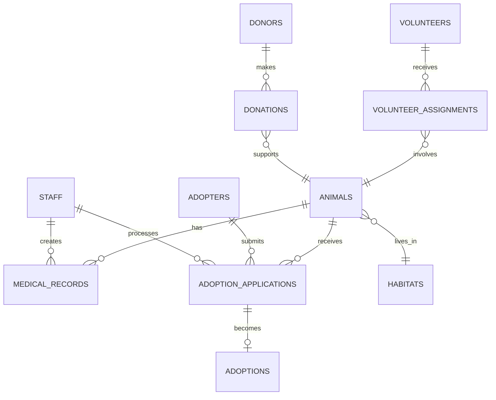

# 🐾 Animal Sanctuary Management System - Capstone Project

## 🚀 Project Overview

This comprehensive capstone project provides a complete **Animal Sanctuary Management System** designed specifically for training manual testers transitioning to automation testing. The project covers three essential testing layers:

- **Database/SQL Testing** - Direct database validation and complex query testing
- **API Testing** - REST API endpoint validation and integration testing  
- **Frontend Testing** - Web application user interface automation (coming soon)

### 🎯 Learning Objectives

By completing this capstone project, candidates will demonstrate proficiency in:

1. **Database Testing Skills**
   - Writing and executing complex SQL queries
   - Validating data integrity and constraints
   - Testing stored procedures and functions
   - Performance testing and optimization

2. **API Testing Skills**
   - REST API endpoint testing
   - Request/response validation
   - Error handling and status codes
   - Integration testing between API and database

3. **Test Automation Skills**
   - Playwright test framework usage
   - Test data management and cleanup
   - Asynchronous testing patterns
   - Cross-layer validation

4. **Real-World Application**
   - Complete adoption workflow testing
   - Business rule validation
   - Data consistency across multiple systems
   - Performance and load testing

---

## 🏗️ System Architecture

### Database Layer
- **MySQL Database** with comprehensive animal sanctuary schema
- **11 interconnected tables** covering animals, adoptions, volunteers, donations
- **Sample data** representing realistic sanctuary operations
- **Views and stored procedures** for common operations

### API Layer
- **Node.js/Express REST API** with full CRUD operations
- **Comprehensive validation** using Joi schemas
- **Error handling and logging** for debugging
- **Rate limiting and security** middleware

### Frontend Layer (Coming Soon)
- **React-based web application** for sanctuary management
- **Multiple user interfaces** (public adoption portal, staff dashboard, admin panel)
- **Real-time updates** and responsive design

---

## 🚀 Quick Start Guide

### Prerequisites

- **Node.js** (version 16 or higher)
- **MySQL** (version 8.0 or higher)
- **Git** for version control

### 1. Database Setup

```bash
# Start MySQL service
sudo systemctl start mysql

# Connect to MySQL
mysql -u root -p

# Create database and import schema
mysql -u root -p < sql-module/capstone/animal-sanctuary-capstone-schema.sql
```

### 2. API Server Setup

```bash
# Navigate to API directory
cd sql-module/capstone/api

# Install dependencies
npm install

# Create environment file
cp .env.example .env

# Edit .env with your database credentials
DB_HOST=localhost
DB_PORT=3306
DB_USER=root
DB_PASSWORD=your_password_here
DB_NAME=animal_sanctuary_capstone

# Start the API server
npm run dev
```

The API server will start on `http://localhost:3001`

### 3. Test Framework Setup

```bash
# Navigate back to main project directory
cd ../../..

# Install Playwright and dependencies (if not already installed)
npm install

# Run the capstone tests
npm test sql-module/capstone/tests/
```

---

## 📊 Database Schema Overview

### Core Entities

#### 🐕 Animals Management
- **animals** - Core animal information and status
- **habitats** - Living environments and capacity management
- **medical_records** - Health tracking and veterinary care

#### 👥 Adoption Workflow  
- **adopters** - Potential and actual adopters
- **adoption_applications** - Application submissions and processing
- **adoptions** - Completed adoption records

#### 🤝 Community Engagement
- **volunteers** - Volunteer management and assignments
- **volunteer_assignments** - Task tracking and hours
- **donors** - Donor information and preferences
- **donations** - Financial contribution tracking

#### 👩‍⚕️ Operations
- **staff** - Employee management and roles
- **activity_log** - Audit trail for all operations
- **system_settings** - Configuration management

### Key Relationships



---

## 🔌 API Endpoints Reference

### Animals Management
- `GET /api/animals` - List animals with filtering
- `GET /api/animals/:id` - Get animal details
- `POST /api/animals` - Add new animal
- `PUT /api/animals/:id` - Update animal information
- `GET /api/animals/search/:term` - Search animals
- `GET /api/animals/stats/summary` - Animal statistics

### Adoption Workflow
- `GET /api/adopters` - List adopters
- `POST /api/adopters` - Register new adopter
- `PUT /api/adopters/:id/background-check` - Update background check
- `GET /api/applications` - List adoption applications
- `POST /api/applications` - Submit adoption application
- `PUT /api/applications/:id/status` - Update application status

### Volunteer Management
- `GET /api/volunteers` - List active volunteers
- `POST /api/volunteers` - Register new volunteer
- `GET /api/volunteer-assignments` - List assignments

### Donations & Support
- `GET /api/donations` - List donations
- `POST /api/donations` - Record new donation
- `GET /api/donors` - List donors

### Reporting & Analytics
- `GET /api/reports/dashboard` - Dashboard summary
- `GET /api/reports/adoptions/monthly` - Adoption trends
- `GET /api/reports/animals/intake` - Intake statistics

### System Health
- `GET /health` - API health check
- `GET /api` - API information and endpoints

---

## 🧪 Testing Structure

### SQL Testing (`tests/sql/`)
- **Basic CRUD operations** - INSERT, UPDATE, DELETE, SELECT
- **Complex queries** - JOINs, subqueries, window functions
- **Data integrity** - Constraints, foreign keys, unique values
- **Business rules** - Adoption workflow validation
- **Performance** - Query optimization and benchmarks

### API Testing (`tests/api/`)
- **Endpoint validation** - Status codes, response structure
- **Data flow** - API to database consistency
- **Error handling** - Invalid inputs, missing data
- **Integration** - Complete adoption workflow
- **Performance** - Response times, concurrent requests

### Test Scenarios Covered

#### 🔄 Complete Adoption Workflow
1. **Adopter Registration** - Create adopter profile
2. **Background Check** - Approve/reject adopter
3. **Application Submission** - Apply for specific animal
4. **Review Process** - Staff review and interview
5. **Approval/Rejection** - Final decision
6. **Adoption Completion** - Finalize adoption

#### 📊 Data Analytics Testing
1. **Dashboard Metrics** - Real-time statistics
2. **Trend Analysis** - Monthly adoption patterns
3. **Resource Utilization** - Habitat occupancy
4. **Financial Tracking** - Donation summaries

#### 🚨 Error Handling
1. **Validation Errors** - Invalid data submission
2. **Business Rule Violations** - Adoption without background check
3. **Database Constraints** - Foreign key violations
4. **Rate Limiting** - Too many requests

---

## 📋 Capstone Assessment Criteria

### Database Testing (25 points)
- **Complex Query Writing** (10 points)
  - Advanced JOINs and subqueries
  - Window functions and analytics
  - Performance optimization

- **Data Integrity Validation** (10 points)
  - Constraint testing
  - Referential integrity
  - Business rule enforcement

- **Test Automation** (5 points)
  - Automated test execution
  - Data setup and cleanup
  - Assertion accuracy

### API Testing (25 points)
- **Endpoint Testing** (10 points)
  - CRUD operations validation
  - Error handling verification
  - Response structure validation

- **Integration Testing** (10 points)
  - Cross-layer data consistency
  - Workflow completion testing
  - Database synchronization

- **Performance Testing** (5 points)
  - Response time validation
  - Concurrent request handling
  - Load testing scenarios

### Test Framework Proficiency (25 points)
- **Playwright Usage** (10 points)
  - Proper test structure
  - Async/await patterns
  - Configuration management

- **Test Design** (10 points)
  - Comprehensive test coverage
  - Edge case identification
  - Maintainable test code

- **Documentation** (5 points)
  - Clear test descriptions
  - Setup instructions
  - Results interpretation

### Business Understanding (25 points)
- **Domain Knowledge** (10 points)
  - Animal sanctuary operations
  - Adoption process understanding
  - Stakeholder requirements

- **Real-World Application** (10 points)
  - Practical test scenarios
  - User journey validation
  - System reliability testing

- **Problem Solving** (5 points)
  - Issue identification
  - Root cause analysis
  - Solution implementation

---

## 🎓 Learning Path Recommendations

### Week 1-2: Database Foundation
1. Set up the database schema
2. Explore sample data and relationships
3. Practice basic SQL operations
4. Write and execute test queries

### Week 3-4: Advanced SQL Skills
1. Master complex JOINs and subqueries
2. Implement window functions
3. Create stored procedures
4. Optimize query performance

### Week 5-6: API Testing Introduction
1. Set up and run the API server
2. Test basic CRUD endpoints
3. Validate request/response data
4. Handle authentication and errors

### Week 7-8: Integration & Automation
1. Combine SQL and API testing
2. Implement complete workflow tests
3. Add performance benchmarks
4. Create comprehensive test suites

### Week 9-10: Advanced Testing Concepts
1. Load and stress testing
2. Security testing basics
3. Continuous integration setup
4. Test reporting and metrics

### Week 11-12: Capstone Project Completion
1. Final testing scenarios
2. Documentation completion
3. Performance optimization
4. Project presentation preparation

---

## 🔧 Troubleshooting Guide

### Common Database Issues

**Connection Errors:**
```bash
# Check MySQL service status
sudo systemctl status mysql

# Restart MySQL if needed
sudo systemctl restart mysql

# Verify database exists
mysql -u root -p -e "SHOW DATABASES;"
```

**Permission Issues:**
```sql
-- Grant necessary permissions
GRANT ALL PRIVILEGES ON animal_sanctuary_capstone.* TO 'your_user'@'localhost';
FLUSH PRIVILEGES;
```

### Common API Issues

**Port Conflicts:**
```bash
# Check if port 3001 is in use
netstat -tulpn | grep :3001

# Kill process if needed
sudo kill -9 <process_id>
```

**Environment Variables:**
```bash
# Verify .env file exists and has correct values
cat sql-module/capstone/api/.env
```

### Test Execution Issues

**Missing Dependencies:**
```bash
# Reinstall node modules
rm -rf node_modules package-lock.json
npm install
```

**Database Connection in Tests:**
```javascript
// Verify test database configuration
const DB_CONFIG = {
    host: process.env.DB_HOST || 'localhost',
    user: process.env.DB_USER || 'root',
    password: process.env.DB_PASSWORD || '',
    database: process.env.DB_NAME || 'animal_sanctuary_capstone'
};
```

---

## 📚 Additional Resources

### SQL Reference Materials
- [MySQL 8.0 Documentation](https://dev.mysql.com/doc/refman/8.0/en/)
- [SQL Window Functions Guide](https://www.postgresql.org/docs/current/tutorial-window.html)
- [Database Design Best Practices](https://www.vertabelo.com/blog/database-design-best-practices/)

### API Testing Resources
- [Playwright API Testing Guide](https://playwright.dev/docs/api-testing)
- [REST API Testing Best Practices](https://assertible.com/blog/rest-api-testing-strategy-guide)
- [HTTP Status Codes Reference](https://httpstatuses.com/)

### Test Automation Resources
- [Playwright Documentation](https://playwright.dev/)
- [Test Automation Patterns](https://testautomationpatterns.org/)
- [Continuous Testing Strategies](https://www.atlassian.com/continuous-delivery/software-testing)

---

## 🤝 Contributing and Support

### Getting Help
- Review the troubleshooting guide above
- Check the issue logs in the console for detailed error messages
- Verify all prerequisites are properly installed
- Ensure database connectivity before running tests

### Project Structure
```
sql-module/capstone/
├── animal-sanctuary-capstone-schema.sql  # Database schema and sample data
├── api/                                   # REST API server
│   ├── server.js                         # Main server file
│   ├── config/database.js                # Database configuration
│   ├── routes/                           # API endpoint definitions
│   ├── middleware/                       # Validation and security
│   └── package.json                      # API dependencies
├── tests/                                # Test automation suite
│   ├── api/                             # API integration tests
│   └── sql/                             # Database validation tests
└── README.md                            # This documentation
```

---

## 🎯 Next Steps

1. **Complete the Setup** - Follow the quick start guide
2. **Explore the Data** - Connect to database and browse sample data
3. **Start Testing** - Run the provided test suites
4. **Build Your Skills** - Add new test scenarios
5. **Master the Concepts** - Progress through the learning path
6. **Prepare for Assessment** - Review the grading criteria

**Ready to transform from manual testing to automation expert? Let's start building! 🚀**

---

*This capstone project is designed to bridge the gap between manual testing experience and modern test automation skills. The real-world animal sanctuary scenario provides engaging context while covering essential technical concepts.*