# SQL Zero-to-Hero for Test Automation
## Complete 12-Week Course Overview

---

## Welcome to SQL Zero-to-Hero!

```mermaid
graph LR
    A[Zero SQL Knowledge] --> B[Module 1: Fundamentals]
    B --> C[Module 2: JOINs]
    C --> D[Module 3: Advanced SQL]
    D --> E[Module 4: Test Integration]
    E --> F[Module 5: Advanced Testing]
    F --> G[Module 6: Final Project]
    G --> H[Hero Level! 🦸‍♂️]
    
    style A fill:#ffcdd2
    style H fill:#c8e6c9
    style B fill:#e3f2fd
    style C fill:#e3f2fd
    style D fill:#fff3e0
    style E fill:#fff3e0
    style F fill:#f3e5f5
    style G fill:#f3e5f5
```

### From Testing Professional to Database Testing Expert

---

## Course Objectives

By the end of this course, you will:

1. ✅ **Master SQL fundamentals** for effective database querying
2. ✅ **Integrate SQL with Playwright** for comprehensive testing
3. ✅ **Validate complex business logic** through database testing
4. ✅ **Implement performance testing** with database queries
5. ✅ **Design secure testing approaches** including SQL injection prevention
6. ✅ **Build production-ready test suites** with database validation

---

## 12-Week Learning Journey

```mermaid
gantt
    title SQL Zero-to-Hero Timeline
    dateFormat X
    axisFormat %d
    
    section Foundation
    Week 1-2 SQL Fundamentals    :milestone, m1, 0, 1d
    Week 3-4 Intermediate SQL     :milestone, m2, 14, 1d
    
    section Advanced
    Week 5-6 Advanced SQL         :milestone, m3, 28, 1d
    Week 7-8 Test Integration     :milestone, m4, 42, 1d
    
    section Mastery
    Week 9-10 Advanced Testing    :milestone, m5, 56, 1d
    Week 11-12 Final Project      :milestone, m6, 70, 1d
```

### Structured Learning Path
- **Weeks 1-4**: Build solid SQL foundation
- **Weeks 5-8**: Advanced concepts + test integration
- **Weeks 9-12**: Master complex scenarios + capstone project

---

## Module Breakdown

### Module 1: SQL Fundamentals (Weeks 1-2)
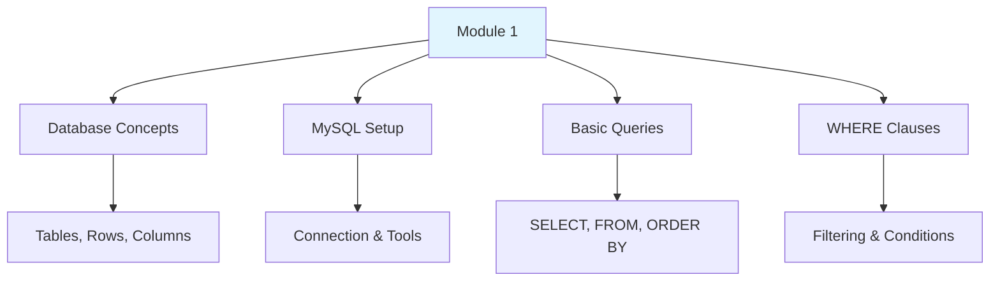

**Key Outcomes**: Understanding databases, writing basic queries, setting up MySQL environment

### Module 2: Intermediate SQL (Weeks 3-4)
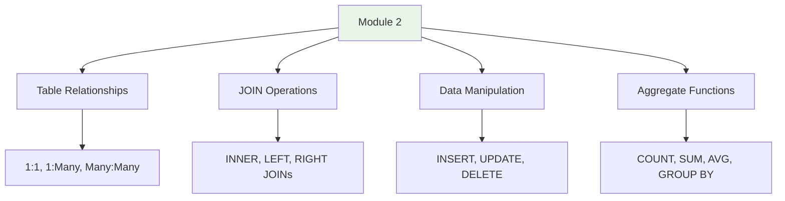

**Key Outcomes**: Multi-table queries, data relationships, complex data operations

---

## Module Breakdown (Continued)

### Module 3: Advanced SQL (Weeks 5-6)
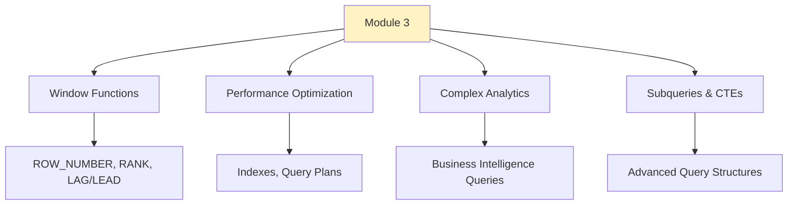

**Key Outcomes**: Advanced analytics, performance tuning, complex business logic queries

### Module 4: SQL in Test Automation (Weeks 7-8)
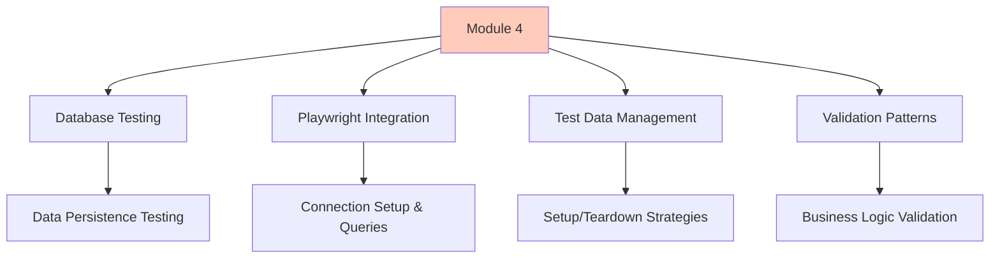

**Key Outcomes**: Database-driven testing, Playwright integration, test data lifecycle

---

## Advanced Modules

### Module 5: Advanced Testing Scenarios (Weeks 9-10)
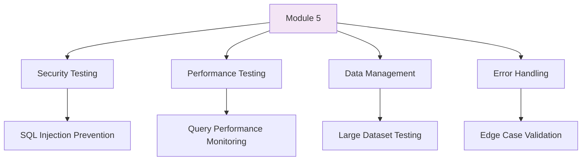

**Key Outcomes**: Security validation, performance benchmarking, enterprise-level testing

### Module 6: Final Project (Weeks 11-12)
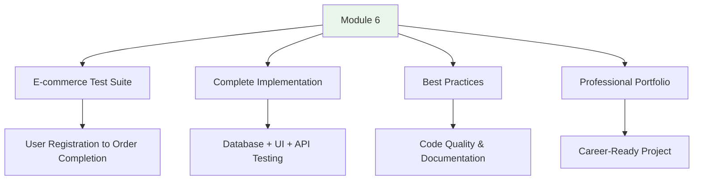

**Key Outcomes**: Portfolio project, comprehensive test suite, professional presentation

---

## Learning Methodology

### Hands-on Approach
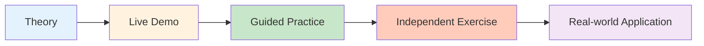

### Each Module Includes:
- 📚 **Conceptual Learning**: Core principles and theory
- 💻 **Live Demonstrations**: Step-by-step examples
- 🛠️ **Hands-on Labs**: Guided practice exercises
- 🎯 **Real-world Projects**: Practical applications
- ✅ **Assessments**: Knowledge validation

---

## Technology Stack

### Database
- **MySQL 8.0+**: Primary database platform
- **Remote Training Database**: Fully configured e-commerce dataset
- **SSL Connections**: Production-like security setup

### Testing Framework
- **Playwright**: Modern browser automation
- **JavaScript/Node.js**: Primary programming language
- **Jest/Playwright Test**: Testing assertions and runners

### Tools & Environment
- **VS Code**: Recommended IDE with extensions
- **MySQL Workbench**: Database management GUI
- **Git**: Version control for all exercises
- **MCP Servers**: Enhanced development tools

---

## Sample E-commerce Database


### Real Production Data Scenarios
- **5,000+ users** with realistic profiles
- **50+ product categories** with inventory
- **10,000+ orders** with complete transaction history
- **Realistic relationships** between all entities

---

## Assessment & Certification

### Module Assessments (40%)
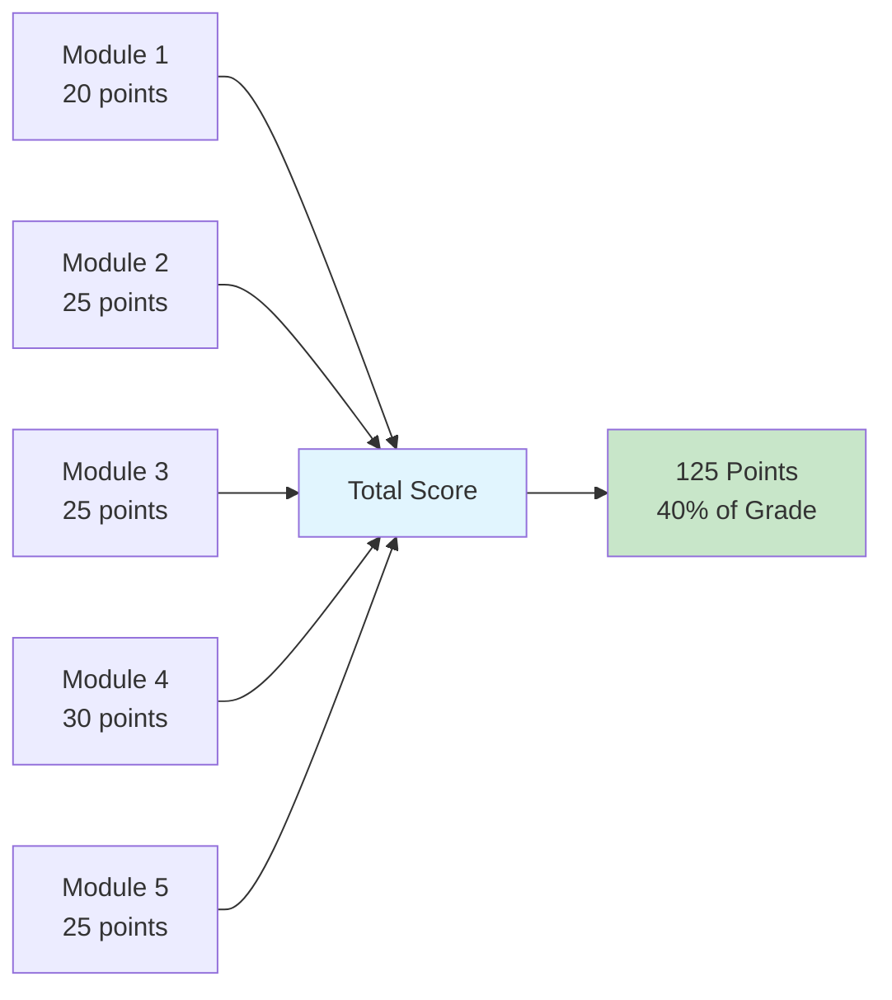

### Practical Labs (30%)
- **Hands-on Exercises**: SQL query challenges
- **Code Reviews**: Best practices implementation
- **Peer Collaboration**: Team problem-solving

### Final Project (30%)
- **Complete Test Suite**: E-commerce application testing
- **Documentation**: Professional project documentation
- **Presentation**: Technical demonstration and Q&A

---

## Career Outcomes

### Skills You'll Master
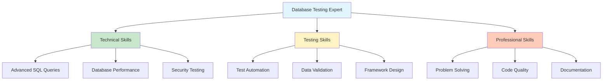

### Career Advancement Opportunities
- **Senior Test Automation Engineer**
- **Database Testing Specialist**
- **Quality Engineering Lead**
- **DevOps Testing Engineer**
- **Test Architecture Roles**

---

## Success Tips

### 1. Consistent Practice
```sql
-- Practice daily with small queries
SELECT * FROM users WHERE created_at >= CURDATE();
```

### 2. Build Real Projects
- Use the training database for all exercises
- Create your own test scenarios
- Document your learning journey

### 3. Join the Community
- Participate in module discussions
- Share solutions and learn from peers
- Ask questions early and often

### 4. Focus on Understanding
- Don't just memorize syntax
- Understand the "why" behind each concept
- Connect database concepts to testing scenarios

---

## Getting Started

### Prerequisites
- Basic understanding of software testing concepts
- Familiarity with web applications
- Willingness to learn and practice consistently

### Required Setup
1. ✅ **Development Environment**: VS Code with recommended extensions
2. ✅ **Database Access**: Connection to training MySQL database
3. ✅ **Playwright Framework**: Node.js and Playwright installation
4. ✅ **Git Repository**: Access to course materials and exercises

### Week 1 Schedule
- **Day 1-2**: Database concepts and MySQL setup
- **Day 3-4**: Basic SELECT queries and filtering
- **Day 5**: Practice exercises and Q&A session

---

## Support & Resources

### Getting Help
- **Office Hours**: Weekly Q&A sessions with instructors
- **Discussion Forums**: Peer collaboration and support
- **1:1 Mentoring**: Available for complex topics
- **Resource Library**: Documentation, tutorials, and references

### Additional Resources
- **SQL Reference Guide**: Quick syntax lookup
- **Best Practices Checklist**: Code quality guidelines
- **Performance Tuning Guide**: Optimization techniques
- **Industry Case Studies**: Real-world implementations

---

## Ready to Begin Your Journey?

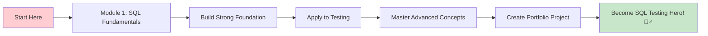

### Next Steps
1. 📋 **Complete Environment Setup**
2. 📚 **Review Module 1 Materials**
3. 💻 **Access Training Database**
4. 🚀 **Begin Your SQL Journey!**

---

## Questions & Getting Started