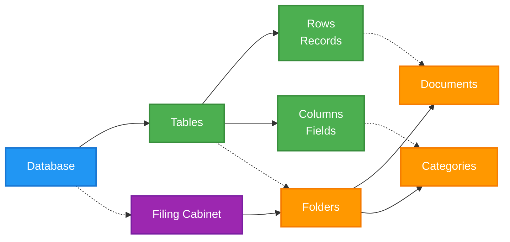
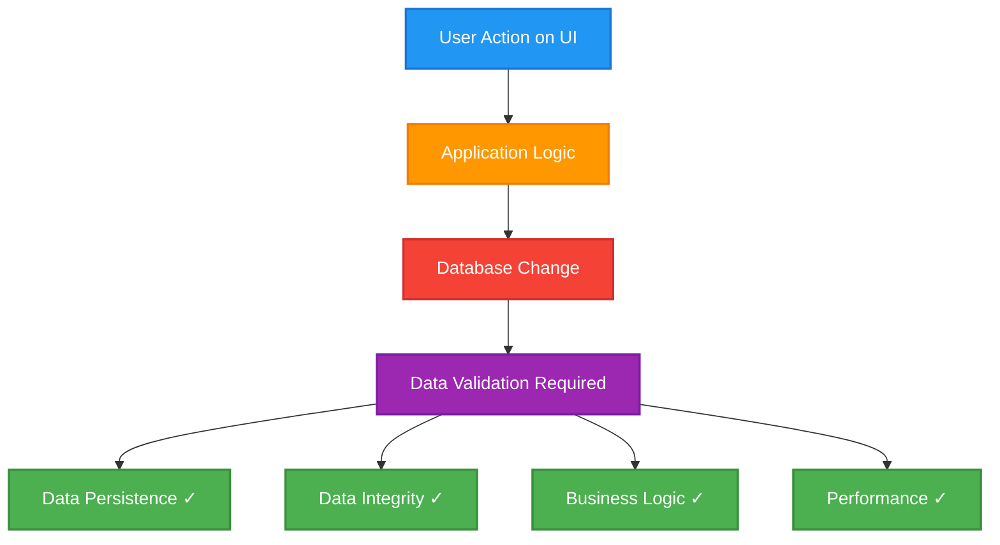
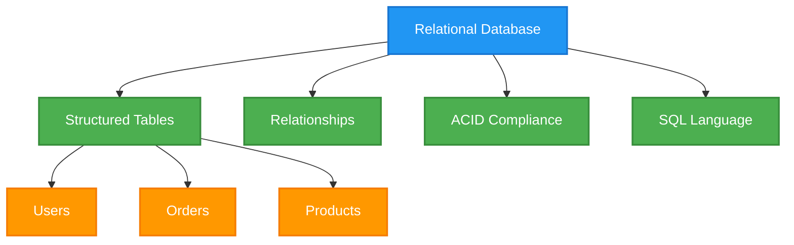
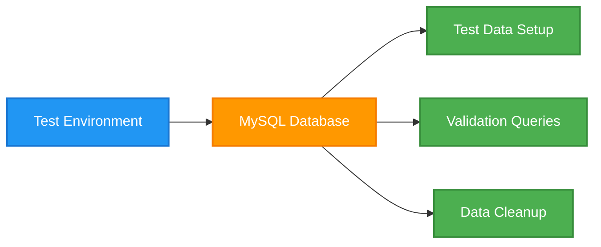
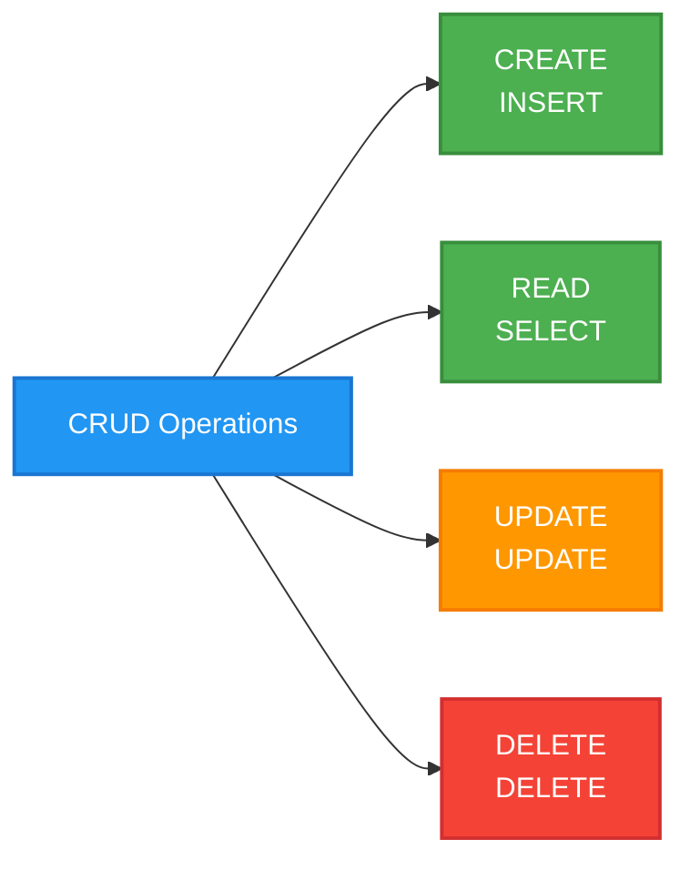
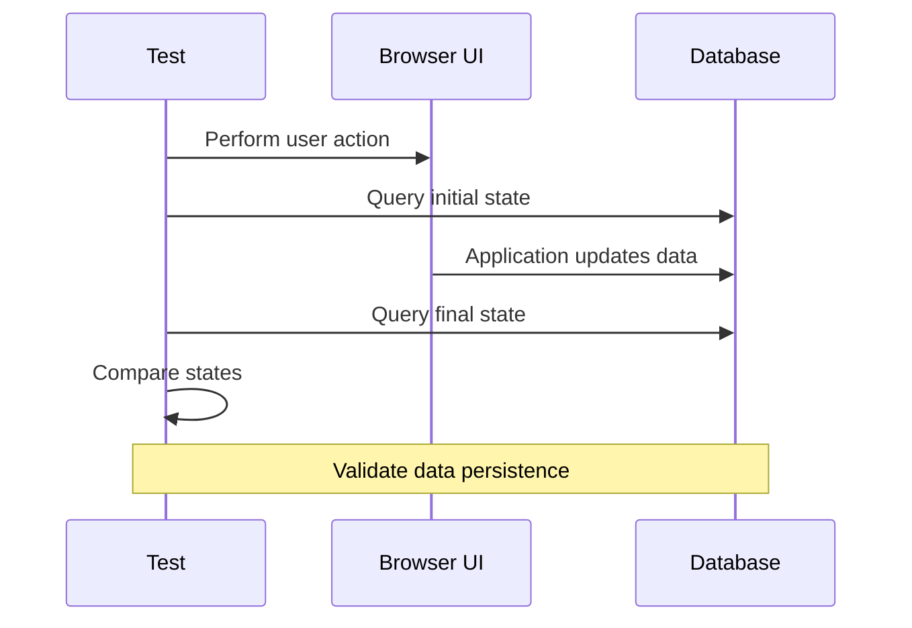

# Module 1: SQL Fundamentals
## Introduction to Databases and SQL

---

## Agenda

1. What is a Database?
2. Why Databases Matter in Testing
3. Introduction to MySQL
4. Basic SQL Queries
5. Hands-on Practice

---

## What is a Database?



**A database is an organized collection of structured information**

- **Tables** = Folders
- **Rows** = Individual documents  
- **Columns** = Fields on a form

---

## Why Databases Matter in Testing



### Critical Validation Points
1. **Data Persistence**: Did the action save correctly?
2. **Data Integrity**: Is data consistent and valid?
3. **Business Logic**: Are rules applied correctly?
4. **Performance**: Response time acceptable?

---

## Database Types

### Relational Databases (SQL)


**Examples**: MySQL, PostgreSQL, Oracle, SQL Server

### Non-Relational (NoSQL)
- Flexible data structures
- Horizontal scaling
- Eventually consistent
- **Examples**: MongoDB, Redis, Cassandra

---

## MySQL Overview

### Why MySQL?
- ✅ **Open-source** and free
- ✅ **Battle-tested** (powers Facebook, Twitter, YouTube)
- ✅ **Reliable** in production environments
- ✅ **Excellent documentation** and community

### MySQL in Testing Context


---

## Basic SQL Syntax

### Core Query Structure
```sql
SELECT column1, column2
FROM table_name
WHERE condition
ORDER BY column1;
```

### The Four Fundamental Operations



---

## SELECT Statements

### Basic SELECT
```sql
-- Select all columns
SELECT * FROM users;

-- Select specific columns
SELECT username, email FROM users;

-- Select with conditions
SELECT * FROM users WHERE is_active = true;
```

### Filtering and Sorting
```sql
-- Multiple conditions
SELECT * FROM products 
WHERE price > 100 AND stock_quantity > 0;

-- Sorting results
SELECT * FROM products 
ORDER BY price DESC, name ASC;

-- Limiting results
SELECT * FROM orders 
ORDER BY created_at DESC 
LIMIT 10;
```

---

## WHERE Clause Operators

| Operator | Description | Example |
|----------|-------------|---------|
| `=` | Equal | `WHERE price = 100` |
| `!=` or `<>` | Not equal | `WHERE status != 'pending'` |
| `>`, `<`, `>=`, `<=` | Comparison | `WHERE price > 50` |
| `LIKE` | Pattern matching | `WHERE name LIKE '%phone%'` |
| `IN` | Value in list | `WHERE status IN ('pending', 'shipped')` |
| `BETWEEN` | Range | `WHERE price BETWEEN 100 AND 500` |
| `IS NULL` | Null check | `WHERE phone IS NULL` |

---

## Hands-on Practice

### Exercise 1: Basic Queries
```sql
-- 1. Get all active users
SELECT * FROM users WHERE is_active = true;

-- 2. Find products under $100
SELECT name, price FROM products WHERE price < 100;

-- 3. Get recent orders (last 30 days)
SELECT * FROM orders 
WHERE created_at >= DATE_SUB(NOW(), INTERVAL 30 DAY);
```

### Exercise 2: Pattern Matching
```sql
-- Find all products with 'phone' in the name
SELECT * FROM products 
WHERE name LIKE '%phone%';

-- Find users with Gmail addresses
SELECT username, email FROM users 
WHERE email LIKE '%@gmail.com';
```

---

## Testing Integration Preview



**Next Module**: We'll learn JOINs to query multiple tables and complex relationships!

---

## Key Takeaways

1. ✅ Databases are essential for data persistence validation
2. ✅ SQL provides powerful querying capabilities
3. ✅ WHERE clauses enable precise data filtering
4. ✅ Understanding basic syntax prepares us for testing integration
5. ✅ MySQL is an excellent choice for test automation projects

### Questions & Discussion