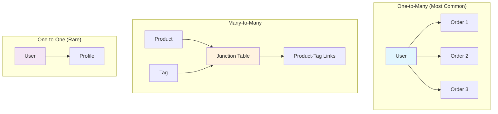

# Module 2: Intermediate SQL
## Working with Multiple Tables and JOINs

---

## Agenda

1. Understanding Table Relationships
2. Types of JOINs
3. INNER JOIN Deep Dive
4. LEFT and RIGHT JOINs
5. Practical Testing Scenarios
6. Data Manipulation (INSERT, UPDATE, DELETE)

---

## Table Relationships


### Three Types of Relationships



---

## JOIN Types Visualization


### When to Use Each JOIN

| JOIN Type | Use Case | Testing Scenario |
|-----------|----------|------------------|
| **INNER** | Both tables have data | Validate complete transactions |
| **LEFT** | All from left + matching right | Find users without orders |
| **RIGHT** | All from right + matching left | Find orphaned orders |
| **FULL OUTER** | Everything from both | Complete data audit |

---

## INNER JOIN Deep Dive

### Basic Syntax
```sql
SELECT columns
FROM table1
INNER JOIN table2 ON table1.id = table2.foreign_key;
```

### Real Example: Users and Their Orders
```sql
SELECT 
    users.username,
    users.email,
    orders.order_number,
    orders.total_amount,
    orders.status
FROM users
INNER JOIN orders ON users.id = orders.user_id
WHERE orders.status = 'delivered'
ORDER BY orders.created_at DESC;
```

### Multiple Table JOINs
```sql
SELECT 
    users.username,
    orders.order_number,
    products.name AS product_name,
    order_items.quantity,
    order_items.unit_price
FROM users
INNER JOIN orders ON users.id = orders.user_id
INNER JOIN order_items ON orders.id = order_items.order_id
INNER JOIN products ON order_items.product_id = products.id
WHERE orders.status = 'delivered';
```

---

## LEFT JOIN for Data Validation

### Finding Missing Relationships
```sql
-- Find users who haven't placed any orders
SELECT 
    users.username,
    users.email,
    users.created_at,
    orders.id AS order_id
FROM users
LEFT JOIN orders ON users.id = orders.user_id
WHERE orders.id IS NULL;
```

### Testing Scenario: User Registration Validation
```sql
-- Verify new user registration didn't create duplicate orders
SELECT 
    users.username,
    COUNT(orders.id) AS order_count
FROM users
LEFT JOIN orders ON users.id = orders.user_id
WHERE users.created_at >= DATE_SUB(NOW(), INTERVAL 1 HOUR)
GROUP BY users.id, users.username;
```

---

## Aggregate Functions with JOINs

### Business Metrics Queries
```sql
-- Customer order statistics
SELECT 
    users.username,
    COUNT(orders.id) AS total_orders,
    SUM(orders.total_amount) AS total_spent,
    AVG(orders.total_amount) AS avg_order_value,
    MAX(orders.created_at) AS last_order_date
FROM users
LEFT JOIN orders ON users.id = orders.user_id
GROUP BY users.id, users.username
HAVING total_orders > 0
ORDER BY total_spent DESC;
```

### Product Performance Analysis
```sql
-- Top selling products
SELECT 
    products.name,
    categories.name AS category,
    SUM(order_items.quantity) AS total_sold,
    SUM(order_items.total_price) AS total_revenue
FROM products
INNER JOIN categories ON products.category_id = categories.id
INNER JOIN order_items ON products.id = order_items.product_id
INNER JOIN orders ON order_items.order_id = orders.id
WHERE orders.status = 'delivered'
GROUP BY products.id, products.name, categories.name
ORDER BY total_revenue DESC
LIMIT 10;
```

---

## Data Manipulation Operations

### INSERT Statements

```sql
-- Insert new user
INSERT INTO users (username, email, password_hash, first_name, last_name)
VALUES ('testuser123', 'test@example.com', 'hashed_password', 'John', 'Doe');

-- Insert with specific ID (testing scenarios)
INSERT INTO categories (id, name, description)
VALUES (999, 'Test Category', 'Category for testing purposes');

-- Insert multiple records
INSERT INTO products (name, price, stock_quantity, category_id, sku)
VALUES 
    ('Test Product 1', 99.99, 10, 1, 'TEST001'),
    ('Test Product 2', 149.99, 5, 1, 'TEST002'),
    ('Test Product 3', 199.99, 3, 2, 'TEST003');
```

### UPDATE Statements

```sql
-- Update single record
UPDATE products 
SET price = 89.99, stock_quantity = 15
WHERE sku = 'TEST001';

-- Update with conditions
UPDATE orders 
SET status = 'shipped', updated_at = NOW()
WHERE status = 'processing' 
AND created_at <= DATE_SUB(NOW(), INTERVAL 2 DAY);

-- Update with JOIN (advanced)
UPDATE products p
INNER JOIN categories c ON p.category_id = c.id
SET p.is_active = false
WHERE c.name = 'Discontinued';
```

---

## DELETE Operations

### Safe Deletion Practices
```sql
-- Delete specific test data
DELETE FROM order_items 
WHERE order_id IN (
    SELECT id FROM orders 
    WHERE order_number LIKE 'TEST_%'
);

-- Cascade deletion (be careful!)
DELETE FROM orders 
WHERE user_id = 999 
AND status = 'cancelled';

-- Soft delete (recommended for production)
UPDATE products 
SET is_active = false, updated_at = NOW()
WHERE id = 123;
```

### Testing Data Cleanup
```sql
-- Clean up test data after test runs
DELETE FROM users 
WHERE username LIKE 'test_%' 
AND created_at >= DATE_SUB(NOW(), INTERVAL 1 HOUR);
```

---

## Testing Integration Examples

### Playwright + SQL Validation
```javascript
test('user registration creates correct database entry', async ({ page }) => {
    // UI Action
    await page.fill('#username', 'testuser123');
    await page.fill('#email', 'test@example.com');
    await page.click('#register');
    
    // Database Validation with JOIN
    const result = await db.query(`
        SELECT 
            users.username,
            users.email,
            users.is_active,
            COUNT(orders.id) as order_count
        FROM users
        LEFT JOIN orders ON users.id = orders.user_id
        WHERE users.username = ?
        GROUP BY users.id
    `, ['testuser123']);
    
    expect(result[0].username).toBe('testuser123');
    expect(result[0].is_active).toBe(true);
    expect(result[0].order_count).toBe(0);
});
```

---

## Common JOIN Patterns in Testing

### 1. Data Completeness Validation
```sql
-- Ensure all orders have valid users
SELECT COUNT(*) as orphaned_orders
FROM orders o
LEFT JOIN users u ON o.user_id = u.id
WHERE u.id IS NULL;
```

### 2. Business Rule Validation
```sql
-- Verify order totals match item totals
SELECT 
    o.order_number,
    o.total_amount as order_total,
    SUM(oi.total_price) as calculated_total
FROM orders o
INNER JOIN order_items oi ON o.id = oi.order_id
GROUP BY o.id
HAVING ABS(order_total - calculated_total) > 0.01;
```

### 3. Performance Testing Queries
```sql
-- Complex query for performance testing
SELECT 
    u.username,
    COUNT(DISTINCT o.id) as order_count,
    COUNT(DISTINCT oi.product_id) as unique_products,
    SUM(oi.quantity) as total_items
FROM users u
LEFT JOIN orders o ON u.id = o.user_id
LEFT JOIN order_items oi ON o.id = oi.order_id
WHERE u.created_at >= DATE_SUB(NOW(), INTERVAL 1 YEAR)
GROUP BY u.id
ORDER BY order_count DESC;
```

---

## Hands-on Exercise

### Exercise: Customer Analysis Query
Write a query that shows:
1. Customer username and email
2. Total number of orders
3. Total amount spent
4. Average order value
5. Most recent order date
6. Only include customers with orders

```sql
-- Your solution here
SELECT 
    u.username,
    u.email,
    COUNT(o.id) as total_orders,
    SUM(o.total_amount) as total_spent,
    AVG(o.total_amount) as avg_order_value,
    MAX(o.created_at) as last_order
FROM users u
INNER JOIN orders o ON u.id = o.user_id
GROUP BY u.id, u.username, u.email
ORDER BY total_spent DESC;
```

---

## Key Takeaways

1. ✅ **JOINs** enable powerful multi-table queries
2. ✅ **LEFT JOIN** finds missing relationships (great for testing)
3. ✅ **Aggregate functions** provide business insights
4. ✅ **Data manipulation** enables test data management
5. ✅ **Complex queries** validate business rules effectively

### Next Module
**Advanced SQL**: Window functions, performance optimization, and complex analytics!

---

## Questions & Discussion