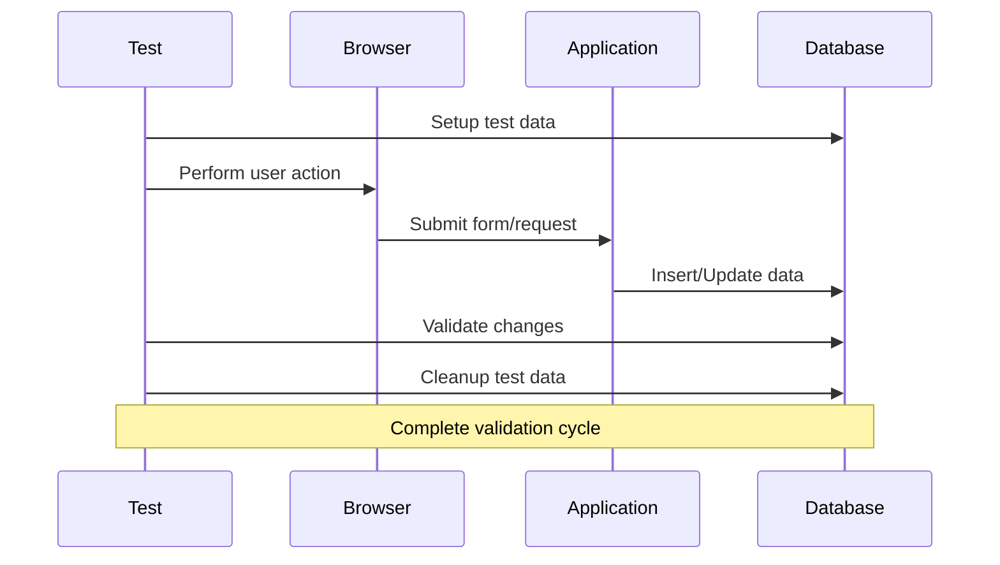
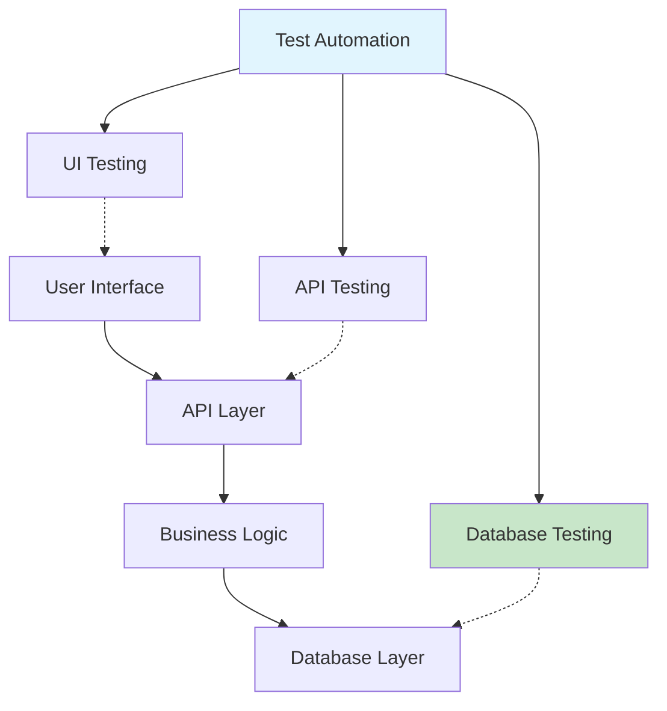

# Module 4: SQL in Test Automation
## Database Testing with Playwright

---

## Agenda

1. Why Database Testing Matters
2. Types of Database Tests
3. Playwright + SQL Integration
4. Database Connection Setup
5. Real-world Testing Patterns
6. Performance Testing with SQL

---

## Database Testing Workflow


### The Complete Testing Loop


---

## Why Database Testing Matters

### Modern Application Architecture


**Database = Single Source of Truth**
- UI shows what database contains
- APIs modify database state
- Business rules enforced at database level

---

## Types of Database Tests

### 1. Data Validation Tests
```javascript
test('user registration saves correct data', async ({ page }) => {
    // UI Action
    await page.fill('#username', 'testuser123');
    await page.fill('#email', 'test@example.com');
    await page.click('#register');
    
    // Database Validation
    const user = await db.queryOne(
        'SELECT * FROM users WHERE email = ?',
        ['test@example.com']
    );
    
    expect(user).not.toBeNull();
    expect(user.username).toBe('testuser123');
    expect(user.is_active).toBe(true);
});
```

### 2. Business Logic Tests
```javascript
test('order total calculation includes tax', async ({ page }) => {
    // Setup
    await addItemToCart('LAPTOP001', 2, 999.99);
    
    // UI Action
    await page.click('#checkout');
    await page.fill('#tax-state', 'CA');
    await page.click('#calculate-total');
    
    // Database Validation
    const order = await db.queryOne(`
        SELECT total_amount, tax_amount 
        FROM orders 
        WHERE user_id = ? 
        ORDER BY created_at DESC LIMIT 1
    `, [testUserId]);
    
    expect(order.tax_amount).toBe(199.998); // 10% CA tax
    expect(order.total_amount).toBe(2199.978);
});
```

---

## Database Connection Setup

### Connection Configuration
```javascript
// src/utils/database.js
import mysql from 'mysql2/promise';

class DatabaseHelper {
    constructor() {
        this.connection = null;
    }
    
    async connect() {
        this.connection = await mysql.createConnection({
            host: process.env.DB_HOST || 'localhost',
            port: process.env.DB_PORT || 3306,
            user: process.env.DB_USER || 'root',
            password: process.env.DB_PASSWORD,
            database: process.env.DB_NAME || 'test_db',
            ssl: process.env.DB_SSL === 'true'
        });
    }
    
    async queryOne(sql, params = []) {
        const [rows] = await this.connection.execute(sql, params);
        return rows[0] || null;
    }
    
    async query(sql, params = []) {
        const [rows] = await this.connection.execute(sql, params);
        return rows;
    }
    
    async close() {
        if (this.connection) {
            await this.connection.end();
        }
    }
}

export default DatabaseHelper;
```

### Playwright Test Setup
```javascript
// playwright.config.js
export default {
    projects: [
        {
            name: 'database-tests',
            use: { 
                baseURL: 'http://localhost:3000',
                extraHTTPHeaders: {
                    'X-Test-Mode': 'true'
                }
            },
        },
    ],
    globalSetup: './tests/global-setup.js',
    globalTeardown: './tests/global-teardown.js',
};
```

---

## Test Data Management

### Setup and Teardown Pattern
```javascript
// tests/fixtures/database-fixtures.js
import { test as base } from '@playwright/test';
import DatabaseHelper from '../src/utils/database.js';

export const test = base.extend({
    db: async ({}, use) => {
        const db = new DatabaseHelper();
        await db.connect();
        await use(db);
        await db.close();
    },
    
    testUser: async ({ db }, use) => {
        // Setup: Create test user
        const userId = await db.queryOne(`
            INSERT INTO users (username, email, password_hash)
            VALUES (?, ?, ?)
        `, ['testuser_' + Date.now(), 'test@example.com', 'hashed_password']);
        
        await use(userId.insertId);
        
        // Teardown: Clean up test user
        await db.query('DELETE FROM users WHERE id = ?', [userId.insertId]);
    }
});
```

### Data-Driven Testing
```javascript
test.describe('Product Price Validation', () => {
    const testCases = [
        { product: 'LAPTOP001', expectedPrice: 999.99 },
        { product: 'PHONE001', expectedPrice: 699.99 },
        { product: 'TABLET001', expectedPrice: 399.99 }
    ];
    
    testCases.forEach(({ product, expectedPrice }) => {
        test(`validates ${product} price`, async ({ page, db }) => {
            // UI Action
            await page.goto(`/products/${product}`);
            const displayedPrice = await page.locator('.price').textContent();
            
            // Database Validation
            const dbPrice = await db.queryOne(
                'SELECT price FROM products WHERE sku = ?',
                [product]
            );
            
            expect(parseFloat(displayedPrice.replace('$', ''))).toBe(expectedPrice);
            expect(dbPrice.price).toBe(expectedPrice);
        });
    });
});
```

---

## Real-world Testing Patterns

### 1. Shopping Cart Persistence
```javascript
test('cart persists across sessions', async ({ page, db, testUser }) => {
    // Add items to cart
    await page.goto('/products/LAPTOP001');
    await page.click('#add-to-cart');
    
    // Verify cart in database
    const cartItems = await db.query(`
        SELECT ci.quantity, p.name, p.price
        FROM cart_items ci
        JOIN products p ON ci.product_id = p.id
        WHERE ci.user_id = ?
    `, [testUser]);
    
    expect(cartItems).toHaveLength(1);
    expect(cartItems[0].name).toContain('Laptop');
    
    // Simulate new session
    await page.context().clearCookies();
    await page.reload();
    await loginAs(page, testUser);
    
    // Verify cart restored from database
    await expect(page.locator('.cart-count')).toHaveText('1');
});
```

### 2. Order Processing Workflow
```javascript
test('complete order workflow', async ({ page, db, testUser }) => {
    // Setup: Add products to cart
    const productId = await setupTestProduct(db);
    await addProductToCart(page, productId, 2);
    
    // Complete checkout
    await page.click('#checkout');
    await fillShippingDetails(page);
    await page.click('#place-order');
    
    // Validate order in database
    const order = await db.queryOne(`
        SELECT o.*, 
               COUNT(oi.id) as item_count,
               SUM(oi.total_price) as calculated_total
        FROM orders o
        LEFT JOIN order_items oi ON o.id = oi.order_id
        WHERE o.user_id = ?
        GROUP BY o.id
        ORDER BY o.created_at DESC
        LIMIT 1
    `, [testUser]);
    
    expect(order.status).toBe('pending');
    expect(order.item_count).toBe(2);
    expect(order.total_amount).toBe(order.calculated_total);
    
    // Validate inventory reduction
    const product = await db.queryOne(
        'SELECT stock_quantity FROM products WHERE id = ?',
        [productId]
    );
    expect(product.stock_quantity).toBe(8); // Reduced by 2
});
```

---

## Performance Testing with SQL

### Database Query Performance
```javascript
test('product search performs within limits', async ({ page, db }) => {
    const startTime = Date.now();
    
    // UI Action
    await page.fill('#search', 'laptop');
    await page.click('#search-btn');
    await page.waitForSelector('.product-grid');
    
    const endTime = Date.now();
    const uiResponseTime = endTime - startTime;
    
    // Test equivalent database query performance
    const dbStartTime = Date.now();
    const results = await db.query(`
        SELECT p.*, c.name as category_name
        FROM products p
        JOIN categories c ON p.category_id = c.id
        WHERE p.name LIKE ? 
        AND p.is_active = true
        ORDER BY p.name
        LIMIT 20
    `, ['%laptop%']);
    const dbEndTime = Date.now();
    const dbResponseTime = dbEndTime - dbStartTime;
    
    // Performance assertions
    expect(uiResponseTime).toBeLessThan(3000); // UI under 3s
    expect(dbResponseTime).toBeLessThan(100);  // DB under 100ms
    expect(results.length).toBeGreaterThan(0);
});
```

### Load Testing Database Operations
```javascript
test('concurrent user registrations', async ({ browser }) => {
    const promises = [];
    const userCount = 10;
    
    // Create multiple browser contexts
    for (let i = 0; i < userCount; i++) {
        const context = await browser.newContext();
        const page = await context.newPage();
        
        promises.push(
            registerUser(page, `user${i}@example.com`)
        );
    }
    
    // Execute all registrations concurrently
    const results = await Promise.allSettled(promises);
    
    // Validate all succeeded
    const successCount = results.filter(r => r.status === 'fulfilled').length;
    expect(successCount).toBe(userCount);
    
    // Validate database consistency
    const dbUsers = await db.query(
        'SELECT COUNT(*) as count FROM users WHERE email LIKE ?',
        ['user%@example.com']
    );
    expect(dbUsers[0].count).toBe(userCount);
});
```

---

## Error Handling and Edge Cases

### Database Constraint Testing
```javascript
test('duplicate email registration fails gracefully', async ({ page, db }) => {
    // Create existing user
    await db.query(`
        INSERT INTO users (username, email, password_hash)
        VALUES (?, ?, ?)
    `, ['existing', 'existing@example.com', 'hash']);
    
    // Attempt duplicate registration
    await page.fill('#email', 'existing@example.com');
    await page.fill('#username', 'newuser');
    await page.click('#register');
    
    // Verify error handling
    await expect(page.locator('.error-message')).toContainText('Email already exists');
    
    // Verify no duplicate created
    const userCount = await db.queryOne(
        'SELECT COUNT(*) as count FROM users WHERE email = ?',
        ['existing@example.com']
    );
    expect(userCount.count).toBe(1);
});
```

### Transaction Testing
```javascript
test('order creation is atomic', async ({ page, db, testUser }) => {
    // Setup: Low stock product
    await db.query(`
        UPDATE products 
        SET stock_quantity = 1 
        WHERE sku = 'LIMITED001'
    `);
    
    // Simulate concurrent orders
    const context1 = await browser.newContext();
    const context2 = await browser.newContext();
    
    const [result1, result2] = await Promise.allSettled([
        placeOrder(context1.newPage(), 'LIMITED001', 1),
        placeOrder(context2.newPage(), 'LIMITED001', 1)
    ]);
    
    // Only one should succeed
    const successCount = [result1, result2].filter(r => r.status === 'fulfilled').length;
    expect(successCount).toBe(1);
    
    // Verify stock is 0, not negative
    const product = await db.queryOne(
        'SELECT stock_quantity FROM products WHERE sku = ?',
        ['LIMITED001']
    );
    expect(product.stock_quantity).toBe(0);
});
```

---

## Best Practices

### 1. Test Data Isolation
```javascript
// Use unique identifiers for each test
const testId = `test_${Date.now()}_${Math.random()}`;
const testEmail = `test_${testId}@example.com`;
```

### 2. Proper Cleanup
```javascript
test.afterEach(async ({ db }) => {
    // Clean up test data
    await db.query(`
        DELETE FROM order_items WHERE order_id IN (
            SELECT id FROM orders WHERE order_number LIKE 'TEST_%'
        )
    `);
    await db.query("DELETE FROM orders WHERE order_number LIKE 'TEST_%'");
    await db.query("DELETE FROM users WHERE username LIKE 'test_%'");
});
```

### 3. Connection Management
```javascript
// Use connection pooling for better performance
const pool = mysql.createPool({
    host: 'localhost',
    user: 'test_user',
    password: 'test_password',
    database: 'test_db',
    connectionLimit: 10,
    acquireTimeout: 60000,
    timeout: 60000,
});
```

---

## Key Takeaways

1. ✅ **Database testing** validates the complete data flow
2. ✅ **Setup/Teardown** ensures test isolation
3. ✅ **Performance testing** includes database query optimization
4. ✅ **Error handling** tests validate business rules
5. ✅ **Connection management** ensures reliable test execution

### Next Module
**Advanced Testing Scenarios**: Security, performance, and complex data workflows!

---

## Questions & Discussion