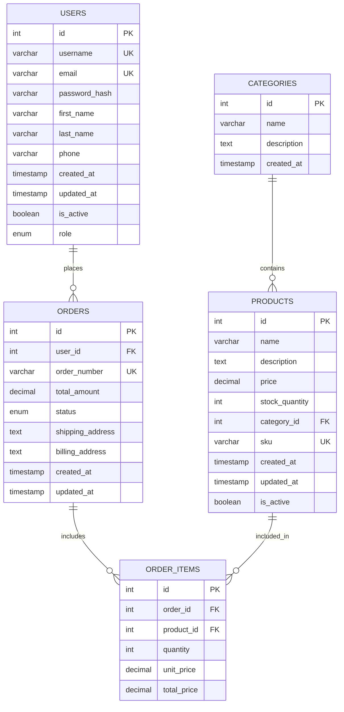

# E-commerce Database ER Diagram

## Relationship Explanations

- **USERS → ORDERS**: One user can place many orders (1:Many)
- **CATEGORIES → PRODUCTS**: One category contains many products (1:Many)  
- **ORDERS → ORDER_ITEMS**: One order includes many items (1:Many)
- **PRODUCTS → ORDER_ITEMS**: One product can be in many order items (1:Many)

## Key Points for Testing

1. **Foreign Key Constraints**: Ensure referential integrity
2. **Unique Constraints**: Test duplicate prevention (username, email, sku, order_number)
3. **Business Rules**: Stock quantity validation, order total calculations
4. **Data Types**: Ensure proper data type validation