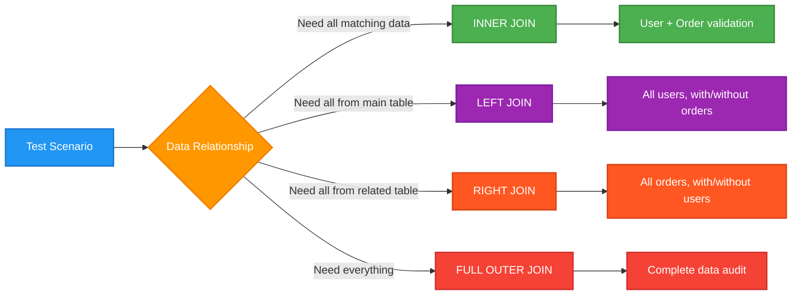

# SQL JOIN Types Visualization

```mermaid
graph TD
    subgraph "INNER JOIN"
        A1[Users Table] 
        A2[Orders Table]
        A3[Only matching records from both tables]
        A1 -.-> A3
        A2 -.-> A3
    end
    
    subgraph "LEFT JOIN"
        B1[Users Table<br/>ALL records]
        B2[Orders Table<br/>Matching only]
        B3[All users + their orders<br/>NULL for users without orders]
        B1 --> B3
        B2 -.-> B3
    end
    
    subgraph "RIGHT JOIN"
        C1[Users Table<br/>Matching only]
        C2[Orders Table<br/>ALL records]
        C3[All orders + their users<br/>NULL for orphaned orders]
        C1 -.-> C3
        C2 --> C3
    end
    
    subgraph "FULL OUTER JOIN"
        D1[Users Table<br/>ALL records]
        D2[Orders Table<br/>ALL records]
        D3[All users AND all orders<br/>NULL where no match]
        D1 --> D3
        D2 --> D3
    end
    
    style A1 fill:#2196F3,stroke:#1976D2,stroke-width:2px,color:#fff
    style A2 fill:#2196F3,stroke:#1976D2,stroke-width:2px,color:#fff
    style A3 fill:#4CAF50,stroke:#388E3C,stroke-width:2px,color:#fff
    style B1 fill:#FF9800,stroke:#F57C00,stroke-width:2px,color:#fff
    style B2 fill:#FF9800,stroke:#F57C00,stroke-width:2px,color:#fff
    style B3 fill:#9C27B0,stroke:#7B1FA2,stroke-width:2px,color:#fff
    style C1 fill:#FF5722,stroke:#D84315,stroke-width:2px,color:#fff
    style C2 fill:#FF5722,stroke:#D84315,stroke-width:2px,color:#fff
    style C3 fill:#9C27B0,stroke:#7B1FA2,stroke-width:2px,color:#fff
    style D1 fill:#607D8B,stroke:#455A64,stroke-width:2px,color:#fff
    style D2 fill:#607D8B,stroke:#455A64,stroke-width:2px,color:#fff
    style D3 fill:#F44336,stroke:#D32F2F,stroke-width:2px,color:#fff
```

## JOIN Usage in Testing

## Common Testing Scenarios

| JOIN Type | Testing Use Case | Example |
|-----------|------------------|---------|
| **INNER JOIN** | Validate active relationships | Users who have placed orders |
| **LEFT JOIN** | Find missing relationships | Users without orders (potential leads) |
| **RIGHT JOIN** | Find orphaned data | Orders without valid users (data integrity) |
| **FULL OUTER** | Complete data audit | All users and orders for reporting |