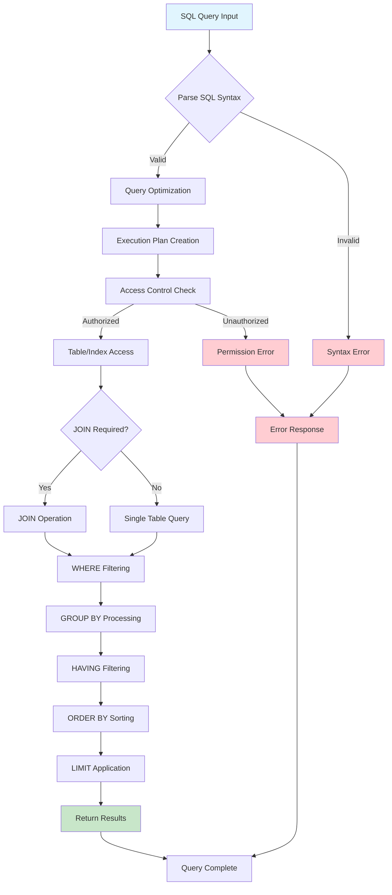

# SQL Query Execution Flow

## Key Testing Points

1. **Syntax Validation**: Test malformed queries
2. **Performance**: Monitor execution time
3. **Authorization**: Test access controls
4. **Result Accuracy**: Validate query results
5. **Error Handling**: Test various error scenarios