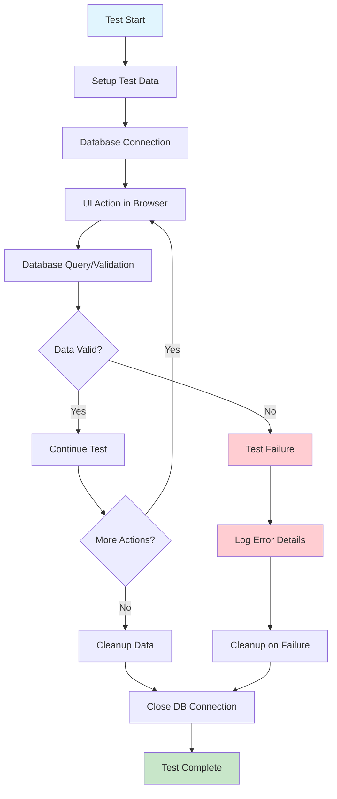
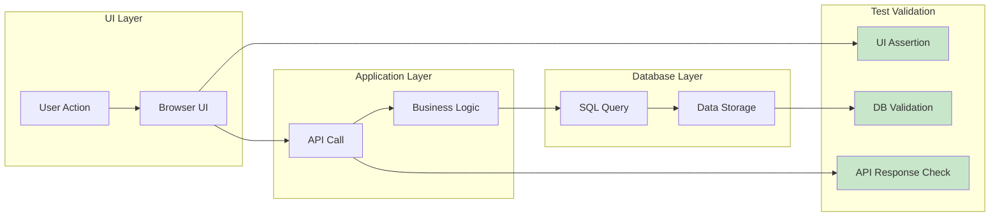

# Database Testing Workflow with Playwright

## Testing Patterns

## Key Testing Principles

1. **Test Data Isolation**: Each test should have independent data
2. **State Verification**: Validate both UI and database state
3. **Rollback Strategy**: Clean up test data after each test
4. **Performance Monitoring**: Track query execution times
5. **Error Scenarios**: Test edge cases and error conditions